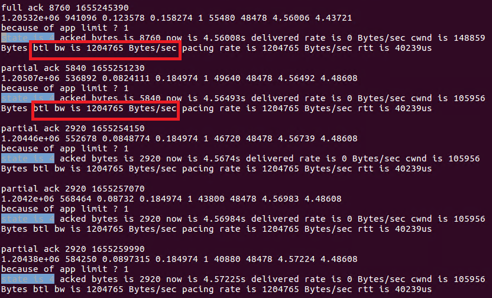

Running TCP-BBR on Seastar
======================

TCP BBR was proposed as a modern TCP congestion control algorithm by Google in 2016. The traditional loss-based TCP algorithms like TCP CUBIC, reduce their sending rates greatly when detecting packet loss, and increase rates conservatively when no packets loss happens. However, it is hard to estimate the network condition just on basis of one metric, i.e, packet loss. As a consequence, loss-based TCP algorithms underutilize network during most of the time, but cause severe congestion occasionally.

TCP BBR is a new variation of TCP algorithm which adjusts its sending rate based on the real-time network metric, i.e, packet round trip time (RTT), the delivered rate (goodput). It is optimal that the amount of traffic walking through a network link is just equal to the well-known bandwidth delay production (BDP). Hence, TCP BBR uses RTT and goodput to constrict the amount of traffic in flight is equal to BDP. In this way, TCP BBR can maximize the goodput, and minimize the RTT at the same time.

## The use of TCP BBR


To use the TCP BBR congestion control algorithm, just select the bbr algorithm from command line options. The command line is listed as follows:

```TCP congestion algorithm options:
  --tcp-congestion arg (=tcp_newreno)   select the tcp congestion algorithm 
                                        (tcp_newreno / tcp_bbr)
```

An example is showed as follows:

`sudo build/release/apps/httpd/httpd --network-stack native --dpdk-pmd --dhcp 0 --host-ipv4-addr 192.168.11.1 --netmask-ipv4-addr 255.255.255.0 --port 80 --collectd 0 --smp 2 -m 2G --lro on --tso on --tcp-congestion tcp_bbr`


## The description of TCP BBR module

In general, the implemention in the Seastar is composed of 3 important components: 1) the rate estimation algorithm, 2) TCP BBR state and model transition algorithm, 3) the packet pacing system.

### The rate estimation algorithm 

This component is used to estimation the bottleneck bandwidth which will be used by TCP BBR algorithm to throttle its sending rate. The implementation is developed as TCP-BBR which is described at [https://tools.ietf.org/id/draft-cheng-iccrg-delivery-rate-estimation-00.html](https://tools.ietf.org/id/draft-cheng-iccrg-delivery-rate-estimation-00.html).
The useful link to discuss such method can also be shown at [https://groups.google.com/forum/#!topic/bbr-dev/EamFWz1N_n4](https://groups.google.com/forum/#!topic/bbr-dev/EamFWz1N_n4). 

In general, the method regards the sending and receiving of each packet as a rate sample, the method records the data acknowledged ( can also be called as `delivered`), between the sending and receiving of the packets. And divided by the time interval between them, which represents the capability of such link to deliver data, i.e., the bottleneck bandwidth.

Even the method is clear and simple in thery, a lot of practial issues have to be addressed. For instance, the packet generated from a app-limit application should not be included, and the packets generated in the `probe rtt` and `probe drain` phase should not be included. In our DPDK implementation, such we cannot close the `tso`, which causes lots of partial acks, and all partial acks for a single large packets generate similar bandwidth, and it can easily cheat the bbr in the `startup` phase, and makes it feel like it reaches bottleneck. 

In our implementation, it is also the most vulnerable part, and we refer the implemtation in the [tcp_rate.cc](https://elixir.bootlin.com/linux/latest/source/net/ipv4/tcp_rate.c) in the Linux kernel. To generate such a rate sample, several packet states have to be recored in the unacked data, i.e., `_snd.data` queue. These states include 
```         
|
            bool app_limit;  
            std::chrono::high_resolution_clock::time_point high_tx_time;
            std::chrono::high_resolution_clock::time_point p_ack_time;
            uint64_t p_delivered_bytes;
            std::chrono::high_resolution_clock::time_point p_send_time;
            std::chrono::high_resolution_clock::time_point p_first_send_time;
            uint64_t send_rate;
```

The `app_limit` is used to whether the sending of this packet is constricted by the network or application. Since the bbr needs a high granularity clock, i.e, us, we use a variable `high_tx_time` to record this to generate rtt measurement. The `p_delivered_bytes` records the highest data delivered when this packet is sent. The `p_ack_time` records the time when the newest packet is received. The `p_send_time` records the sending time of this packet. The `p_first_send_time` records the time when the newest received packet is sent from source. `send_rate` is kept temporarily to record the pacing rate when this packet is sent, and it is useful in the startup phase, though it is not included in the original implementation.

We can easily validate our pacing system by running our program on a link with capacity of 10Mbps, i.e., (1.25MB/s), and observe the estimation change.


### The state and model transition algorithm

This component is just developed as the instruction of TCP-BBR:

```
|
             |
             V
    +---> STARTUP  ----+
    |        |         |
    |        V         |
    |      DRAIN   ----+
    |        |         |
    |        V         |
    +---> PROBE_BW ----+
    |      ^    |      |
    |      |    |      |
    |      +----+      |
    |                  |
    +---- PROBE_RTT <--+

```
The bbr transfers beween these states, and we use `void enter_startup();
void enter_drain(); void enter_probe_bw(); void enter_probe_rtt();` to realize it. In each state, bbr has different `pacing_gain` and `cwnd_gain`. Most importantly, the main interface for this component is the `bbr_update_model_and_state` function, each time a packet is received, the bbr will call this function to update its state and model. Since the `btl_bw` and `prop_rtt` are the two variables bbr concerns, the `update_rtt` and `update_btl_bw` function are responsible for them. 

In the `startup` phase, bbr doubles its sending rate and cwnd as other tcp congestion control algorithms. The only difference is it is not only doubles cwnd, but also controls the sending rate 2.885X as the btl_bw, and packets are paced as the pacing_rate (pacing_gain * btl_bw). After the `startup` phase, usually a queue in the link is built, and bbr will enter the `drain` phase to drain such a queue by slowing down the packet pacing. When the packets in flight are smaller than the estimated BDP (btl * prop_rtt), bbr exits such state and enter the `probe bw` state. The `prop bw` state is the normal state for bbr, it paces around the btl_bw it measured previously, and increases 1.25X by its pacing rate to try to grab more bandwidth in such state, and decreases 0.75X its pacing rate to carefully drain the queue caused from the previous attempt. After 10s elapsed since the bbr measures the smallest rtt, it will enter the `prop_rtt` phase, and suddenly throttle its cwnd to 4*mss to wait for all packets in flight are received, since it is easier to get the propgation delay in an empty link. 

### The packet pacing system

This component is responsible to limit sending rate to the estimated bottleneck bandwidth as TCP BBR. We bypass all the original `output()` function, and instead of sending a packet inmmediately, we use a timer to pace all packets to the bottleneck bandwidth, and a `time_out()` function is triggered to call `output()` function to send packets at the speed of the bottleneck bandwidth.

We can easily validate our pacing system by directly limit the pacing rate to be a fixed number, e.g., 8Mbps (1MB/s), and observe the downloading rate.


## Reproducing the results 

We can observe the long-term performance of TCP BBR just by fetching a large video, which makes the transmission last long enough. In our exprimentaion, a 1.3GB video file is placed under the home directory. We just use the same environment as what in BBR paper, i.e., a link with capacity of 10Mbps, delay of 40ms. 

1. use the Seastar as a http server, and run `sudo build/release/apps/httpd/httpd --network-stack native --dpdk-pmd --dhcp 0 --host-ipv4-addr 192.168.11.1 --netmask-ipv4-addr 255.255.255.0 --port 80 --collectd 0 --smp 2 -m 2G --lro on --tso on --tcp-congestion tcp_bbr ` 

2. use a ubuntu PC as a client, and run `curl --local-port 10000  -o video-1.3GB.mkv 192.168.11.1/file/home/hcy/video-1.3GB.mkv`

### The basic state and model transition

We can easily observe the basic state and model transition by a single flow situation. We capture 3000 packets that send from server to client, and show the thoughput phase generated by the `wireshark` and show it in the following picture.


We can easily see the the bbr starts with a `startup` phase which doubles sending rate in each round, and it reaches the bottlneck bandwidth(1.25 MB/s) very quickly. Then bbr keeps trying to increase its rate to explore more bandwidth, but since it exceeds the link capacity, even the server increase the sending rate, it will not get bigger throughput. After 3 rounds, the bbr knows it reaches the bottleneck bandwidth, and it enters the second phase `drain`. It reduces the sending rate to 0.75X the bottleneck bandwidth, until the flight size equals to its estimated BDP. It can be shown in the picture, as there is a obvious rate drop after the peak. After that, the bbr enters the `probe bw` phase, which is the normal state for bbr. In this phase, bbr paces around its estimated bottleneck bandwidth, and it muptily its sending rate by [1.25, 0.75, 1, 1, 1, 1] to try to grab more free bandwidth and not cause queuing delay. Most importantly, the `probe rtt` phase is the distinct phase for bbr, in this phase, bbr suddenly reduces its congestion window to 4*mss, and wait for all the packets in flight are received. By that time, bbr has the best chance to meature the propgation rtt of a link, and excludes the impact of queuing delay. bbr enters the `probe rtt` phase 10s later than the time it meatures the minimum rtt. And we can see a obvious rate vally every 10s in the picture.  

### The convergence of mutltiple flows(TODO)

### The performace in a lossy link(TODO)


