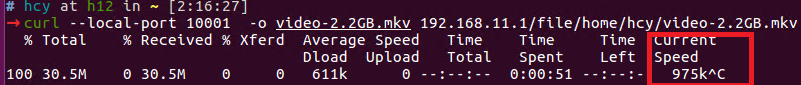

Running TCP-BBR on Seastar
======================

TCP BBR was proposed as a modern TCP congestion control algorithm by Google in 2016. The traditional loss-based TCP algorithms like TCP CUBIC, reduce their sending rates greatly when detecting packet loss, and increase rates conservatively when no packets loss happens. However, it is hard to estimate the network condition just on basis of one metric, i.e, packet loss. As a consequence, loss-based TCP algorithms underutilize network during most of the time, but cause severe congestion occasionally.

TCP BBR is a new variation of TCP algorithm which adjusts its sending rate based on the real-time network metric, i.e, packet round trip time (RTT), the delivered rate (goodput). It is optimal that the amount of traffic walking through a network link is just equal to the well-known bandwidth delay production (BDP). Hence, TCP BBR uses RTT and goodput to constrict the amount of traffic in flight is equal to BDP. In this way, TCP BBR can maximize the goodput, and minimize the RTT at the same time.

## The use of TCP BBR


To use the TCP BBR congestion control algorithm, just select the bbr algorithm from command line options. The command line is listed as follows:

```TCP congestion algorithm options:
  --tcp-congestion arg (=tcp_newreno)   select the tcp congestion algorithm 
                                        (tcp_newreno / tcp_bbr)
```

An example is showed as follows:

`sudo build/release/apps/httpd/httpd --network-stack native --dpdk-pmd --dhcp 0 --host-ipv4-addr 192.168.11.1 --netmask-ipv4-addr 255.255.255.0 --port 80 --collectd 0 --smp 2 -m 2G --lro on --tso on --tcp-congestion tcp_bbr`


## The description of TCP BBR module

In general, the implemention in the Seastar is composed of 3 important components: 1) the rate estimation algorithm, 2) TCP BBR state and model transition algorithm, 3) the packet pacing system.

### The rate estimation algorithm 

This component is used to estimation the bottleneck bandwidth which will be used by TCP BBR algorithm to throttle its sending rate. The implementation is developed as TCP-BBR which is described at [https://tools.ietf.org/id/draft-cheng-iccrg-delivery-rate-estimation-00.html](https://tools.ietf.org/id/draft-cheng-iccrg-delivery-rate-estimation-00.html).

We can easily validate our pacing system by running our program on a link with capacity of 10Mbps, i.e., (1.25MB/s), and observe the estimation change.

### The state and model transition algorithm

This component is just developed as the instruction of TCP-BBR:

```
             |
             V
    +---> STARTUP  ----+
    |        |         |
    |        V         |
    |      DRAIN   ----+
    |        |         |
    |        V         |
    +---> PROBE_BW ----+
    |      ^    |      |
    |      |    |      |
    |      +----+      |
    |                  |
    +---- PROBE_RTT <--+

```

### The packet pacing system

This component is responsible to limit sending rate to the estimated bottleneck bandwidth as TCP BBR. We bypass all the original `output()` function, and instead of sending a packet inmmediately, we use a timer to pace all packets to the bottleneck bandwidth, and a `time_out()` function is triggered to call `output()` function to send packets as the bottleneck bandwidth.

We can easily validate our pacing system by directly limit the pacing rate to be a fixed number, e.g., 8Mbps (1MB/s), and observe the downloading rate.




## Reproducing the results 

We can observe the long-term performance of TCP BBR just by fetching a large video, which makes the transmission last long enough. In our exprimentaion, a 1.3GB video file is placed under the home directory. We just use the same environment as what in BBR pacper, i.e., a link with capacity of 10Mbps, delay of 40ms. 

1. use the Seastar as a http server, and run `sudo build/release/apps/httpd/httpd --network-stack native --dpdk-pmd --dhcp 0 --host-ipv4-addr 192.168.11.1 --netmask-ipv4-addr 255.255.255.0 --port 80 --collectd 0 --smp 2 -m 2G --lro on --tso on --tcp-congestion tcp_bbr ` 

2. use a ubuntu PC as a client, and run `curl --local-port 10000  -o video-1.3GB.mkv 192.168.11.1/file/home/hcy/video-1.3GB.mkv`

### The basic state and model transition(TODO)

### The convergence of mutltiple flows(TODO)

### The performace in a lossy link(TODO)